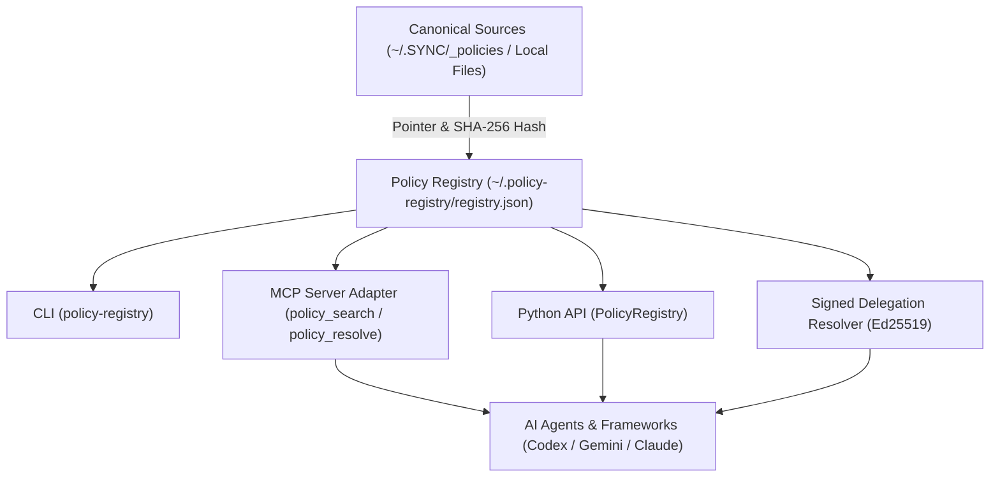

# policy-registry

[](https://www.python.org/downloads/)
[](LICENSE)
[](https://github.com/ellmos-ai)
[](https://github.com/open-bricks)
[](tests/)
[](llms.txt)

[🇩🇪 Deutsch](README_de.md) | **🇬🇧 English**

> [!NOTE]
> **AI & LLM Integration Notice**: This repository includes an [`llms.txt`](llms.txt) index file tailored for automated context ingestion, agentic system prompts, and LLM code understanding.

`policy-registry` is an autonomous, reusable **LOCAL-FIRST** registry for policies, rules, and decisions. It stores metadata pointers and SHA-256 hashes referencing canonical sources rather than duplicating full text. This ensures local sources remain authoritative and discoverable even when OneDrive, `.SYNC`, or `system-gap-master` are unreachable.

---

## Test Status

Verified local test pass as of 2026-08-16 (Python 3.12.10):

- `python -m pytest --collect-only` collects 72 tests.
- `python -m pytest` passes 72/72 tests (100% green).

---

## System Architecture



---

## Security & Authority Contract

- The local registry at `~/.policy-registry/registry.json` is authoritative for its metadata.
- Canonical policy text remains at `source.uri`.
- Fields like `content`, `body`, `full_text`, and `payload` are rejected as registry entries.
- Valid, explicitly adopted `policy`, `rule`, or `decision` entries resolve according to the shared hierarchical scope contract, followed by priority and precedence.
- If a norm is missing, insufficient, or in conflict, resolution reports an **advisory TOM-lm fallback notice** without automatic execution or unwarranted authority.
- TOM results may be recorded as `evidence` or `decision-candidate`. An explicit adoption is required to generalize into a policy.

### Scope Contract

`PolicyRegistry` and the signed delegation resolver share the matcher in [`src/policy_registry/scope.py`](src/policy_registry/scope.py):

1. Global aliases `*`, `all`, `global`, and `system-wide` match any scope.
2. Normal scopes match exactly and inherit to descendants (`project:alpha` applies to `project:alpha/release`).
3. `project:alpha/*` matches descendants only, not the parent itself.
4. Precedence order: `exact > /* > parent > global`. When relation matches, deeper path wins.
5. Sibling scopes do not match.
6. Empty consumer filter matches all; empty consumer list or `*` is universal; otherwise exact match is required.

---

## Metadata Model

Every entry supports the following fields:

| Field | Description |
|---|---|
| `id`, `kind`, `title` | Stable identifier and entry kind |
| `scope`, `consumers` | Scope boundaries and consumer actors |
| `owner`, `authority` | Owner and authority classification |
| `priority`, `precedence` | Resolution ordering rank |
| `version`, `hash` | Version and optional SHA-256 checksum |
| `privacy` | `public`, `internal`, `private`, `restricted` |
| `source.uri` | Pointer to canonical source document |
| `status`, `adoption` | Lifecycle state and explicit adoption record |

The normative JSON Schema is maintained at [`schemas/policy-entry.schema.json`](schemas/policy-entry.schema.json).

---

## CLI Usage

```powershell
policy-registry init
policy-registry import-sync --root "$HOME\OneDrive\.SYNC\_policies" --slot workstation
policy-registry search "OneDrive" --consumer codex
policy-registry resolve --scope system-wide --query "OneDrive"
policy-registry verify
```

An alternative registry path can be set with `--registry` or `POLICY_REGISTRY_PATH`.

`resolve` returns exit code `0` on definitive resolution. Statuses `missing`, `insufficient`, and `conflict` return exit code `2` with structured advisory guidance and `automatic_authority: false`.

---

## Python API

```python
from policy_registry import PolicyRegistry

registry = PolicyRegistry()
matches = registry.search("release", scope=".AI/.MODULES", consumer="codex")
decision = registry.resolve(scope="system-wide", query="OneDrive")
```

### Signed Delegation Resolver

`policy-registry` can verify an issuer-signed delegation grant and a delegate-signed decision candidate against a pinned trust store:

```powershell
policy-registry resolve-delegation `
  --grant signed-grant.json `
  --candidate signed-candidate.json `
  --trust-store issuer-trust.json
```

Full specification and boundaries: [`docs/SIGNED_DELEGATION_RESOLVER.md`](docs/SIGNED_DELEGATION_RESOLVER.md).

---

## Model Context Protocol (MCP) Server

The optional MCP server adapter provides `policy_search`, `policy_get`, and `policy_resolve`:

```powershell
pip install "policy-registry[mcp]"
python -m policy_registry.mcp_server
```

The MCP extra is bounded to the maintained MCP SDK v1 line `>=1.28.1,<2`.

---

## Ecosystem & Related Tools

| Repository | Purpose |
|---|---|
| [`ellmos-ai/memoryhooker`](https://github.com/ellmos-ai/memoryhooker) | Hook-based long-term memory & context layer for LLM agents |
| [`ellmos-ai/ellmos-scheduler`](https://github.com/ellmos-ai/ellmos-scheduler) | Deterministic task runner and scheduler for multi-agent workflows |
| [`ellmos-ai/ellmos-voice-io`](https://github.com/ellmos-ai/ellmos-voice-io) | Speech I/O adapter for multimodal assistants |
| [`dev-bricks/automation-master`](https://github.com/dev-bricks/automation-master) | Local-first event-sourcing ledger and credit-gate automation engine |
| [`dev-bricks/CodeBox`](https://github.com/dev-bricks/CodeBox) | Safe multi-language sandboxed execution environment |

---

## MVP Boundaries

- No automated full-text duplication or indexing.
- No automated TOM-lm execution.
- No automated adoption without explicit command.
- No cloud hosted dependencies (100% Local-First).
- No unauthenticated remote host mutations.

---

## License

MIT License — see [LICENSE](LICENSE).
