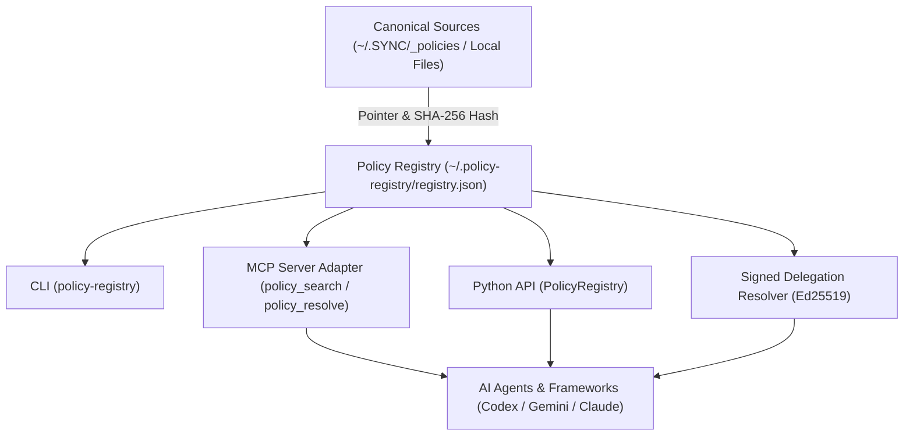
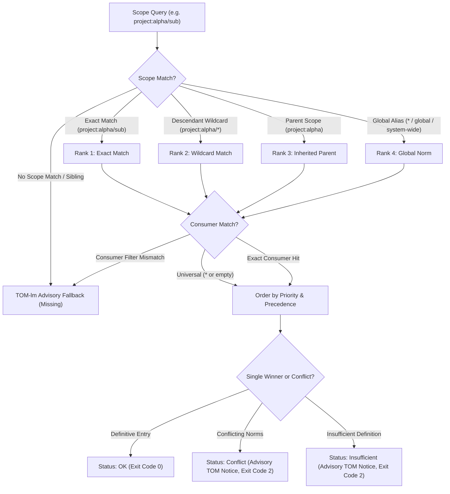
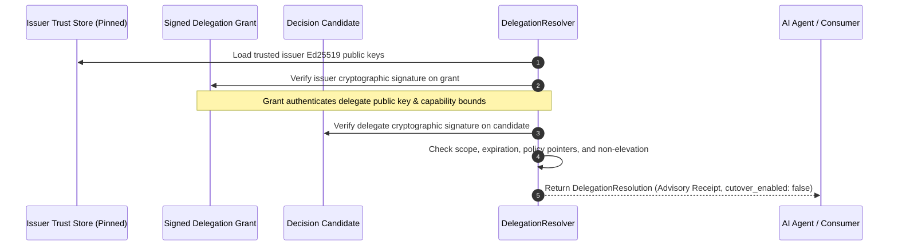

# policy-registry

[](https://github.com/ellmos-ai/policy-registry/actions/workflows/ci.yml)
[](https://github.com/ellmos-ai/policy-registry/releases)
[](https://www.python.org/downloads/)
[](https://github.com/astral-sh/ruff)
[](tests/)
[](LICENSE)
[](https://github.com/ellmos-ai/policy-registry)
[](ARCHITECTURE.md)
[](SECURITY.md)
[](SECURITY.md)
[](SECURITY.md)
[](https://github.com/ellmos-ai)
[](https://github.com/open-bricks)
[](llms.txt)

[🇩🇪 Deutsch](README_de.md) | **🇬🇧 English** | 🛡️ [Security Policy](SECURITY.md) | 📝 [Changelog](CHANGELOG.md) | 📋 [llms.txt](llms.txt)

> [!NOTE]
> **AI & LLM Integration Notice**: This repository includes an [`llms.txt`](llms.txt) index file tailored for automated context ingestion, agentic system prompts, and LLM code understanding.

## 🧭 Quick Navigation

- [What is policy-registry?](#what-is-policy-registry)
- [Discovery Context & Keywords](#discovery-context)
- [Test Status & Verification](#test-status)
- [System Architecture & Data Flow](#system-architecture)
- [Scope Resolution & Hierarchical Precedence](#scope-resolution--hierarchical-precedence)
- [Signed Delegation Verification Lifecycle](#signed-delegation-verification-lifecycle)
- [Governance & Runtime Invariants Matrix](#governance--runtime-invariants)
- [Security & Authority Contract](#security--authority-contract)
- [Metadata Model & JSON Schemas](#metadata-model)
- [CLI Usage & Workflows](#cli-usage)
- [Python API & Integration](#python-api)
- [Model Context Protocol (MCP) Server](#model-context-protocol-mcp-server)
- [Sibling Projects & Ecosystem Matrix](#sibling-projects--ecosystem-matrix)
- [Security Policy & Vulnerability Reporting](#security-policy--vulnerability-reporting)
- [Haftung & Liability Notice](#haftung--liability)

---

## What is policy-registry?

`policy-registry` is an autonomous, reusable **LOCAL-FIRST** registry for policies, rules, and decisions. It stores metadata pointers and SHA-256 hashes referencing canonical sources rather than duplicating full text. This ensures local sources remain authoritative and discoverable even when OneDrive, `.SYNC`, or `system-gap-master` are unreachable.

The complete decision-system bundle always includes [`decision-clicker`](https://github.com/ellmos-ai/decision-clicker) as its human writer and UI. Policy Registry owns pointer discovery and resolution; Decision Clicker performs guarded writes to the same `_DECISIONS` chain. This required composition does not create a Python import dependency between the two packages.

---

## Discovery Context

When searching or integrating policy management in multi-agent environments, use the canonical search phrase `ellmos-ai/policy-registry`. Unlike server-based engines (such as Open Policy Agent / OPA, AWS IAM, or Kubernetes admission webhooks), `policy-registry` is strictly **local-first and pointer-based**:

- **Target Ecosystem**: Autonomous LLM agent fleets (Codex, Gemini, Claude Desktop, Antigravity) and offline microservices.
- **Pointer-Only Architecture**: It never stores or duplicates full text in registry records, avoiding cloud sync corruption and stale file drifts.
- **Cryptographic Delegation**: Verifies Ed25519 issuer grants and candidate signatures locally against pinned public trust stores without external PKI dependencies.
- **Fail-Closed Fallback**: Missing, insufficient, or conflicting policies trigger structured advisory TOM-lm notices rather than arbitrary execution.

---

## Test Status

Verified local test pass as of 2026-09-08 (Python 3.12.10):

- `python -m pytest --collect-only` collects 157 tests.
- `python -m pytest` passes 157/157 tests (100% green).
- `ruff check .` passes with 0 lint warnings.
- `python -m compileall -q .` succeeds across the entire codebase.

---

## System Architecture



---

## Scope Resolution & Hierarchical Precedence

The diagram below illustrates how `PolicyRegistry` and the signed delegation resolver evaluate scopes, precedence ranks, and fallback advisories:



---

## Signed Delegation Verification Lifecycle

`policy-registry` provides cryptographic verification for issuer-delegated decision candidates:



---

## Governance & Runtime Invariants

`policy-registry` enforces 10 strict architectural guarantees for safe, local-first, deterministic policy resolution and signed delegation:

| # | Invariant | Description | Enforcement Level |
|---|---|---|---|
| 1 | **100% Local-First / Zero-Egress** | Strictly local filesystem storage (`~/.policy-registry/registry.json`). Zero unauthenticated network calls, zero telemetry exfiltration. | Architectural Guarantee |
| 2 | **Pointer-Only Architecture** | Stores canonical URI references (`source.uri`), SHA-256 checksums, scopes, and priorities. Rejects payload bodies or raw text duplication. | Core Data Schema |
| 3 | **Signed Delegation Verifier** | Verifies Ed25519 issuer-grant and delegate-candidate signatures against a pinned public trust store (`IssuerTrustStore`). | Cryptographic Engine |
| 4 | **Advisory TOM-lm & Fail-Closed Precedence** | Ambiguous, missing, or conflicting norms return status code `2` with advisory TOM-lm notice and `automatic_authority: false`. | Resolution Pipeline |
| 5 | **Append-Only Rule Register** | Explicit `adopt` materializes audited rules via append-only rows. Superseding an existing rule never deletes historical records. | Audit & State Invariant |
| 6 | **Interaction Authority Modes** | Effective runtime modes (`governance-bound` default, `user-sovereign`, `chat-authority-only`) evaluated with session override and project fallback. | Authority Controller |
| 7 | **Non-Elevation (RunAsInvoker)** | Runs unprivileged in standard user space without elevated or administrative privileges. | Process Security Boundary |
| 8 | **Multi-OS CI Matrix** | Automated cross-platform matrix testing across Ubuntu, Windows, and macOS on Python 3.10, 3.11, 3.12, and 3.13. | GitHub Actions CI |
| 9 | **Strict CI Concurrency & Bytecode Gate** | `cancel-in-progress: true` prevents redundant runner compute; whole-repo `compileall` ensures 100% valid bytecode. | Automated Build Gate |
| 10 | **Bilingual Parity & Contract Tests** | 100% German/English parity across READMEs, docs, and automated contract tests verifying all metadata and schema constraints. | Contract Test Suite |

---

## Security & Authority Contract

- The local registry at `~/.policy-registry/registry.json` is authoritative for its metadata.
- Canonical policy text remains at `source.uri`.
- Fields like `content`, `body`, `full_text`, and `payload` are rejected as registry entries.
- Valid, explicitly adopted `policy`, `rule`, or `decision` entries resolve according to the shared hierarchical scope contract, followed by priority and precedence.
- If a norm is missing, insufficient, or in conflict, resolution reports an **advisory TOM-lm fallback notice** without automatic execution or unwarranted authority.
- TOM results may be recorded as `evidence` or `decision-candidate`. An explicit adoption is required to generalize into a policy.
- Interaction authority is effective and independent from the storage-source switch: `governance-bound` (default) ranks adopted registry governance over chat, `user-sovereign` ranks the current user instruction first while reporting governance follow-up candidates, and `chat-authority-only` intentionally removes governance binding. External-effect gates remain user-controlled in every mode.
- Session mode overrides project mode; projects can set `[policy_registry].interaction_mode` in `.policy-registry.toml`. Invalid or ambiguous mode configuration fails closed to `governance-bound`.
- The optional BYUM v2 seam accepts only a prevalidated, closed pointer envelope. It copies no
  options, rationales, prompts, decision text, private payloads, action data, or receipts and always
  emits `decision-candidate` / `pending` / `advisory-pointer` metadata.

### Scope Contract

`PolicyRegistry` and the signed delegation resolver share the matcher in [`src/policy_registry/scope.py`](src/policy_registry/scope.py):

1. Global aliases `*`, `all`, `global`, and `system-wide` match any scope.
2. Normal scopes match exactly and inherit to descendants (`project:alpha` applies to `project:alpha/release`).
3. `project:alpha/*` matches descendants only, not the parent itself.
4. Precedence order: `exact > /* > parent > global`. When relation matches, deeper path wins.
5. Sibling scopes do not match.
6. Empty consumer filter matches all; empty consumer list or `*` is universal; otherwise exact match is required.

---

## Metadata Model

Every entry supports the following fields:

| Field | Description |
|---|---|
| `id`, `kind`, `title` | Stable identifier and entry kind |
| `scope`, `consumers` | Scope boundaries and consumer actors |
| `owner`, `authority` | Owner and authority classification |
| `priority`, `precedence` | Resolution ordering rank |
| `version`, `hash` | Version and optional SHA-256 checksum |
| `privacy` | `public`, `internal`, `private`, `restricted` |
| `source.uri` | Pointer to canonical source document |
| `status`, `adoption` | Lifecycle state and explicit adoption record |

The normative JSON Schema is maintained at [`schemas/policy-entry.schema.json`](schemas/policy-entry.schema.json).

---

## CLI Usage

```powershell
policy-registry init
policy-registry import-sync --root "$HOME\OneDrive\.SYNC\_policies" --slot workstation
policy-registry seed-decisions --control-center-root "$HOME\OneDrive\.TOPICS\_control-center"
policy-registry search "OneDrive" --consumer codex
policy-registry resolve --scope system-wide --query "OneDrive"
policy-registry resolve --scope project:alpha --mode user-sovereign --instruction "Use alpha mode"
policy-registry propose-change --id change:alpha --title "Use alpha" --scope project:alpha --owner LG --session session-501 --quote "Use alpha mode" --at 2026-08-30T18:45:00Z
policy-registry adopt change:alpha --rule-id rule:alpha@v1 --at 2026-08-30T19:00:00Z
policy-registry verify
```

`propose-change` is deliberately non-authoritative: it records a hash-bound chat provenance envelope as `decision-candidate` / `pending`. `adopt` is the separate explicit step that materializes an audited `rule` through the append-only `register_rule()` contract; `--supersedes` replaces a predecessor without deleting its row. See [`docs/AUTORITAETS-MODI.md`](docs/AUTORITAETS-MODI.md).

`seed-decisions` registers a small, fixed set of pointer entries onto the real decision-record locations (chain head, host-file naming pattern, the settled-decisions ledger, the generated machine index, and the project-local `DECISIONS.md` convention) -- never individual decisions themselves. See [`ARCHITECTURE.md`](ARCHITECTURE.md) for the full contract.

The Python-only BYUM seam in `policy_registry.adapters.byum` receives an already validated
`ellmos.policy-registry.byum-pointer.v1` mapping. It performs no BYUM import or file/event parsing;
`candidate_entry()` returns pointer-only registry metadata and `register_candidate()` writes it only
to the explicitly supplied `PolicyRegistry` instance.

An alternative registry path can be set with `--registry` or `POLICY_REGISTRY_PATH`.

`resolve` returns exit code `0` on definitive resolution. Statuses `missing`, `insufficient`, and `conflict` return exit code `2` with structured advisory guidance and `automatic_authority: false`.

---

## Python API

```python
from policy_registry import PolicyRegistry

registry = PolicyRegistry()
matches = registry.search("release", scope=".AI/.MODULES", consumer="codex")
decision = registry.resolve(scope="system-wide", query="OneDrive")

candidate = registry.propose_change(
    change_id="change:alpha", title="Use alpha", scope="project:alpha", owner="LG",
    session="session-501", quote="Use alpha mode", captured_at="2026-08-30T18:45:00Z",
)
registry.adopt_change(
    candidate["id"], rule_id="rule:alpha@v1", adopted_at="2026-08-30T19:00:00Z"
)
```

### Signed Delegation Resolver

`policy-registry` can verify an issuer-signed delegation grant and a delegate-signed decision candidate against a pinned trust store:

```powershell
policy-registry resolve-delegation `
  --grant signed-grant.json `
  --candidate signed-candidate.json `
  --trust-store issuer-trust.json
```

Full specification and boundaries: [`docs/SIGNED_DELEGATION_RESOLVER.md`](docs/SIGNED_DELEGATION_RESOLVER.md).

---

## Model Context Protocol (MCP) Server

The optional MCP server adapter provides `policy_search`, `policy_get`, and `policy_resolve`:

```powershell
pip install "policy-registry[mcp]"
python -m policy_registry.mcp_server
```

The MCP extra is bounded to the maintained MCP SDK v1 line `>=1.28.1,<2`.

---

## Sibling Projects & Ecosystem Matrix

`policy-registry` is part of the `ellmos-ai` and `open-bricks` local-first agent ecosystem:

| Repository | Purpose | Ecosystem |
|---|---|---|
| [`ellmos-ai/decision-clicker`](https://github.com/ellmos-ai/decision-clicker) | Human writer & UI for the decision-system bundle | `ellmos-ai` |
| [`ellmos-ai/memoryhooker`](https://github.com/ellmos-ai/memoryhooker) | Hook-based long-term memory & context layer for LLM agents | `ellmos-ai` |
| [`ellmos-ai/ellmos-scheduler`](https://github.com/ellmos-ai/ellmos-scheduler) | Deterministic task runner and scheduler for multi-agent workflows | `ellmos-ai` |
| [`ellmos-ai/ellmos-voice-io`](https://github.com/ellmos-ai/ellmos-voice-io) | Speech I/O adapter for multimodal assistants | `ellmos-ai` |
| [`ellmos-ai/lock-master`](https://github.com/ellmos-ai/lock-master) | Multi-agent locking & lease protocol for concurrent autonomous workflows | `ellmos-ai` |
| [`ellmos-ai/ticket-master`](https://github.com/ellmos-ai/ticket-master) | Deterministic ticket management and lifecycle coordinator | `ellmos-ai` |
| [`ellmos-ai/clutch`](https://github.com/ellmos-ai/clutch) | Task execution coordinator and agent runtime | `ellmos-ai` |
| [`ellmos-ai/ellmos-controlcenter-mcp`](https://github.com/ellmos-ai/ellmos-controlcenter-mcp) | Gateway and orchestrator for local MCP tool bundles | `ellmos-ai` |
| [`ellmos-ai/ellmos-filecommander-mcp`](https://github.com/ellmos-ai/ellmos-filecommander-mcp) | Local-first desktop file management MCP server | `ellmos-ai` |
| [`ellmos-ai/ellmos-codecommander-mcp`](https://github.com/ellmos-ai/ellmos-codecommander-mcp) | AST-aware code analysis & transformation MCP server | `ellmos-ai` |
| [`ellmos-ai/n8n-manager-mcp`](https://github.com/ellmos-ai/n8n-manager-mcp) | Local-first n8n workflow management MCP server | `ellmos-ai` |
| [`dev-bricks/automation-master`](https://github.com/dev-bricks/automation-master) | Local-first event-sourcing ledger and credit-gate automation engine | `dev-bricks` |
| [`dev-bricks/DevCenter`](https://github.com/dev-bricks/DevCenter) | Developer workspace and automation cockpit | `dev-bricks` |
| [`dev-bricks/CodeBox`](https://github.com/dev-bricks/CodeBox) | Safe multi-language sandboxed execution environment | `dev-bricks` |
| [`dev-bricks/companion-for-agy`](https://github.com/dev-bricks/companion-for-agy) | PTY terminal companion and session manager for Antigravity | `dev-bricks` |
| [`dev-bricks/safe-start-for-codex`](https://github.com/dev-bricks/safe-start-for-codex) | Workspace initializer and preflight security checker for Codex | `dev-bricks` |
| [`open-bricks/open-bricks`](https://github.com/open-bricks) | Open-source developer tools umbrella | `open-bricks` |

---

## MVP Boundaries

- No automated full-text duplication or indexing.
- No automated TOM-lm execution.
- No automated adoption without explicit command.
- No Stage-3 norm reconciler or automatic BYUM/TOM feedback; reconciliation output is advisory and `automatic: false`.
- No cloud hosted dependencies (100% Local-First).
- No unauthenticated remote host mutations.

---

## Security Policy & Vulnerability Reporting

`policy-registry` adheres to strict local-first security standards:

- **Initial Response SLA**: Within 48 hours of report submission.
- **Triage Assessment SLA**: Within 5 business days.
- **Security Contacts**: `security@ellmos.ai` | `security@open-bricks.org` | `support@lukasgeiger.com` | `lukas@open-bricks.org`
- **Private Advisory**: [Submit Security Advisory](https://github.com/ellmos-ai/policy-registry/security/advisories)
- **Full Policy**: See [SECURITY.md](SECURITY.md) for details on supported versions and cryptographic delegation boundaries.

---

## Haftung & Liability Notice

This software is provided "as is", without warranty of any kind, express or implied, including but not limited to the warranties of merchantability, fitness for a particular purpose, and noninfringement. In no event shall the authors or copyright holders be liable for any claim, damages, or other liability, whether in an action of contract, tort, or otherwise, arising from, out of, or in connection with the software or the use or other dealings in the software.

---

## License

MIT License — see [LICENSE](LICENSE).
