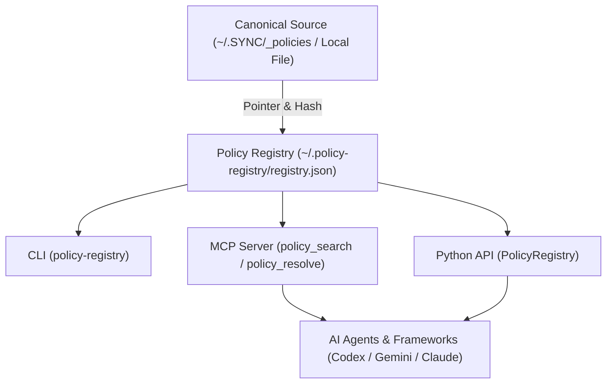

# policy-registry

[](https://www.python.org/downloads/)
[](LICENSE)
[](https://github.com/ellmos-ai)
[](https://github.com/open-bricks)
[](tests/)

> [!NOTE]
> **AI & LLM Integration Notice**: This repository includes an [`llms.txt`](llms.txt) index file tailored for automated context ingestion, agentic system prompts, and LLM code understanding.

`policy-registry` ist ein eigenständiges, wiederverwendbares **LOCAL-FIRST** Register für Policies, Regeln und Entscheidungen. Es speichert Metadaten und Pointer auf kanonische Quellen, nicht deren Volltext. Dadurch bleiben lokale Quellen autoritativ und auffindbar, auch wenn OneDrive, `.SYNC` oder `system-gap-master` nicht verfügbar sind.

## Teststatus

Aktueller lokaler Nachweis vom 2026-08-08 nach der Scope-Vertragsvereinheitlichung mit Python 3.12.10:

- `python -m pytest --collect-only` sammelt 66 Tests.
- `python -m pytest` besteht mit 66/66 Tests.

## Systemarchitektur



## Sicherheits- und Autoritätsvertrag

- Die lokale Registry unter `~/.policy-registry/registry.json` ist autoritativ für ihre Metadaten.
- Kanonischer Regeltext bleibt an `source.uri`.
- `content`, `body`, `full_text` und `payload` werden als Registry-Felder abgewiesen.
- Gültige, explizit adoptierte `policy`, `rule` oder `decision` werden nach dem
  gemeinsamen hierarchischen Scope-Vertrag, danach nach Priorität und Präzedenz
  aufgelöst.
- Fehlt eine Norm, reicht sie nicht aus oder widersprechen sich gleichrangige Normen, meldet die Auflösung einen **beratenden TOM-lm-Fallback**. Sie ruft TOM-lm nicht automatisch auf und verleiht seinem Ergebnis keine Autorität.
- Ein TOM-Ergebnis darf als `evidence` oder `decision-candidate` registriert werden. Erst eine explizite Adoption macht daraus eine generalisierte Policy.

### Scope-Vertrag

`PolicyRegistry` und der signierte Delegation-Resolver teilen den Matcher aus
[`src/policy_registry/scope.py`](src/policy_registry/scope.py). Die globalen
Aliaswerte `*`, `all`, `global` und `system-wide` gelten überall. Ein normaler
Scope gilt exakt und wird an Nachkommen vererbt; `project:alpha/*` gilt nur für
Nachkommen. Die Präzedenz lautet `exact > /* > parent > global`, bei gleicher
Relation gewinnt der tiefere Pfad. Geschwister matchen nicht. Ein leerer
Consumerfilter bedeutet „alle“, eine leere Consumerliste oder `*` ist universal;
andernfalls ist der Consumer-Code exakt zu treffen. Die Delegation-Prüfung bleibt
für stale oder nicht materialisierte Quellen fail-closed.

## Metadatenmodell

Jeder Eintrag kennt mindestens:

| Feld | Bedeutung |
|---|---|
| `id`, `kind`, `title` | stabile Identität und Typ |
| `scope`, `consumers` | Geltungsbereich und konsumierende Akteure |
| `owner`, `authority` | Eigentümer und Autoritätsart |
| `priority`, `precedence` | Auflösungsrang |
| `version`, `hash` | Version und optionaler SHA-256-Nachweis |
| `privacy` | `public`, `internal`, `private`, `restricted` |
| `source.uri` | Pointer auf die kanonische Quelle |
| `status`, `adoption` | Lebenszyklus und explizite Übernahme |

Das normative JSON-Schema liegt unter `schemas/policy-entry.schema.json`.

## CLI

```powershell
policy-registry init
policy-registry import-sync --root "$HOME\OneDrive\.SYNC\_policies" --slot workstation
policy-registry search "OneDrive" --consumer codex
policy-registry resolve --scope system-wide --query "OneDrive"
policy-registry verify
```

Ein alternativer lokaler Pfad kann mit `--registry` oder `POLICY_REGISTRY_PATH` gesetzt werden.

`resolve` liefert Exit `0` nur bei eindeutiger expliziter Auflösung. `missing`, `insufficient` und `conflict` liefern Exit `2` und einen strukturierten TOM-lm-Hinweis mit `automatic_authority: false`.

## Python-API

```python
from policy_registry import PolicyRegistry

registry = PolicyRegistry()
matches = registry.search("release", scope=".AI/.MODULES", consumer="codex")
decision = registry.resolve(scope="system-wide", query="OneDrive")
```

### Signed Delegation Resolver (V4-08 candidate)

`policy-registry` can verify an issuer-signed delegation grant and a
delegate-signed `predicted/delegated-avatar-decision` candidate against the
current local registry. The issuer key comes from an external pinned trust
store; the signed grant pins the delegate key. Current project/global user
decisions and policies retain higher authority.

The runtime cutover is deliberately disabled: even a fully qualified candidate
returns `cutover_enabled: false` and `authorizes_action: false`.

```powershell
policy-registry resolve-delegation `
  --grant signed-grant.json `
  --candidate signed-candidate.json `
  --trust-store issuer-trust.json
```

Contract, trust chain, gates and nonclaims:
[`docs/SIGNED_DELEGATION_RESOLVER.md`](docs/SIGNED_DELEGATION_RESOLVER.md).

## MCP

Der optionale MCP-Adapter stellt `policy_search`, `policy_get` und `policy_resolve` bereit:

```powershell
pip install "policy-registry[mcp]"
python -m policy_registry.mcp_server
```

Das MCP-Extra ist für CLI und Python-API nicht erforderlich.

## `.SYNC/_policies` und system-gap-master

Der Adapter `policy_registry.adapters.sync_policies` liest die bestehenden Formate:

- `library/P-*.md`
- `adoption/<slot>.json`
- `sources/<slot>.json`

Er migriert ausschließlich Metadaten, Pfade und Hashes. Die Quelldokumente bleiben kanonisch. Eine aggregierte Sicht kann als `_policies/registry/<slot>.json` in derselben bestehenden Struktur erzeugt werden:

```powershell
policy-registry export-sync-view `
  --root "$HOME\OneDrive\.SYNC\_policies" `
  --slot workstation
```

`system-gap-master` ist ein optionaler Transportadapter. Ist es nicht installiert oder `.SYNC` nicht erreichbar, bleiben Registrierung, Suche, Auflösung und Prüfung vollständig funktionsfähig.

## Grenzen des MVP

- keine automatische Volltextindexierung;
- kein automatischer TOM-lm-Aufruf;
- keine automatische Adoption;
- kein Hosted-Service;
- keine Fremdhost-Synchronisation oder Behauptung über deren Zustand.
