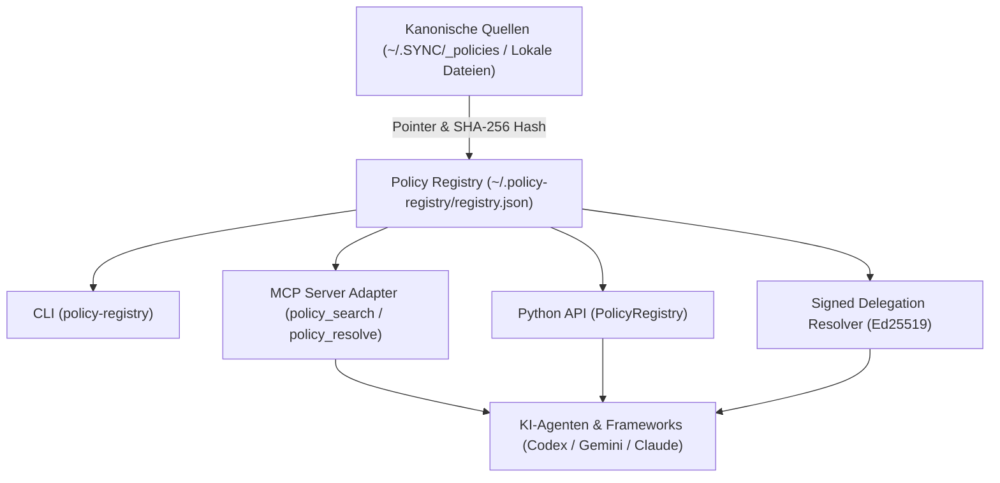
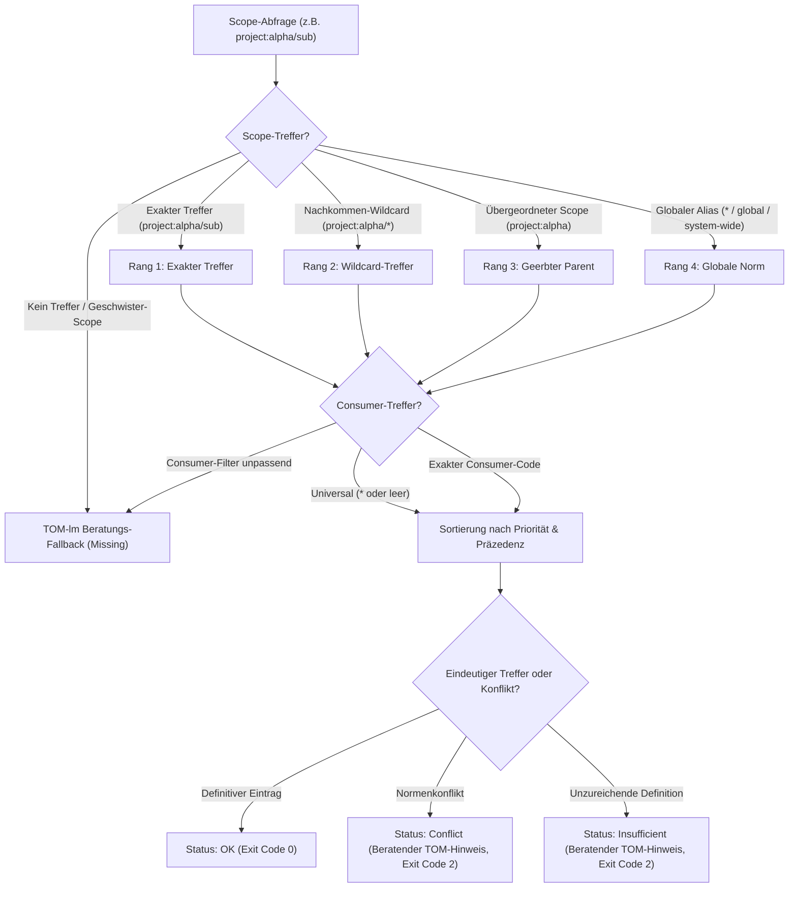
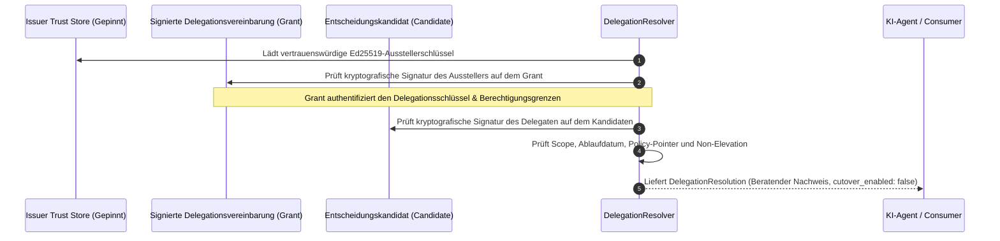

# policy-registry

[](https://github.com/ellmos-ai/policy-registry/actions/workflows/ci.yml)
[](https://github.com/ellmos-ai/policy-registry/releases)
[](https://www.python.org/downloads/)
[](https://github.com/astral-sh/ruff)
[](tests/)
[](LICENSE)
[](https://github.com/ellmos-ai/policy-registry)
[](ARCHITECTURE.md)
[](SECURITY.md)
[](SECURITY.md)
[](SECURITY.md)
[](THIRD_PARTY_LICENSES.md)
[](MARKETING-LOG.txt)
[](https://github.com/ellmos-ai)
[](https://github.com/open-bricks)
[](llms.txt)

**🇩🇪 Deutsch** | [🇬🇧 English](README.md) | 🛡️ [Security Policy](SECURITY.md) | 📝 [Changelog](CHANGELOG.md) | 📋 [llms.txt](llms.txt) | 📜 [Drittanbieter-Lizenzen](THIRD_PARTY_LICENSES.md)

> [!NOTE]
> **KI- & LLM-Integrationshinweis**: Dieses Repository enthält eine [`llms.txt`](llms.txt)-Indexdatei für automatisierte Kontextaufnahme, System-Prompts für Agenten und maschinelles Codeverständnis.

## 🧭 Schnellnavigation

- [Was ist policy-registry?](#was-ist-policy-registry)
- [Discovery-Kontext & Suchbegriffe](#discovery-kontext)
- [Teststatus & Verifikation](#teststatus)
- [Systemarchitektur & Datenfluss](#systemarchitektur)
- [Scope-Auflösung & Hierarchische Präzedenz](#scope-auflösung--hierarchische-präzedenz)
- [Lebenszyklus der kryptografischen Delegationsprüfung](#lebenszyklus-der-kryptografischen-delegationsprüfung)
- [Governance- & Laufzeit-Invarianten](#governance---laufzeit-invarianten)
- [Sicherheits- & Autoritätsvertrag](#sicherheits---autoritätsvertrag)
- [Metadatenmodell & Schemas](#metadatenmodell)
- [CLI-Nutzung & Workflows](#cli-nutzung)
- [Python-API & Integration](#python-api)
- [Model Context Protocol (MCP) Server](#model-context-protocol-mcp-server)
- [Geschwisterprojekte & Ökosystem-Matrix](#geschwisterprojekte--ökosystem-matrix)
- [Drittanbieter-Lizenzen & Transparenz](#drittanbieter-lizenzen--transparenz)
- [Marketing & Zielgruppen](#marketing--zielgruppen)
- [Sicherheitsrichtlinie & Meldung von Schwachstellen](#sicherheitsrichtlinie--meldung-von-schwachstellen)
- [Haftungsausschluss & Liability](#haftungsausschluss--liability)

---

## Was ist policy-registry?

`policy-registry` ist ein eigenständiges, wiederverwendbares **LOCAL-FIRST**-Register für Policies, Regeln und Entscheidungen. Es speichert Metadaten und Pointer auf kanonische Quellen, nicht deren Volltext. Dadurch bleiben lokale Quellen autoritativ und auffindbar, auch wenn OneDrive, `.SYNC` oder `system-gap-master` nicht verfügbar sind.

Zum vollständigen Entscheidungssystem-Bundle gehört [`decision-clicker`](https://github.com/ellmos-ai/decision-clicker) fest als menschlicher Writer und Benutzeroberfläche. Policy Registry besitzt die Pointer-Suche und Auflösung; Decision Clicker schreibt kontrolliert in dieselbe `_DECISIONS`-Kette. Diese verpflichtende Komposition erzeugt keine Python-Importabhängigkeit zwischen beiden Paketen.

---

## Discovery-Kontext

Für die Einbindung in Multi-Agenten-Umgebungen und Suchanfragen lautet die kanonische Suchphrase `ellmos-ai/policy-registry`. Im Gegensatz zu cloudbasierten Policy-Engines (wie Open Policy Agent / OPA, AWS IAM oder Kubernetes-Admission-Webhooks) ist `policy-registry` strikt **lokal-first und zeigerbasiert**:

- **Ziel-Ökosystem**: Autonome LLM-Agentenflotten (Codex, Gemini, Claude Desktop, Antigravity) und Offline-Systeme.
- **Reine Zeiger-Architektur (Pointer-Only)**: Keine Duplikation von Volltexten im Register, wodurch Cloud-Sync-Konflikte und Dateidrift verhindert werden.
- **Kryptografische Delegation**: Lokale Ed25519-Signaturprüfung von Aussteller-Grants und Kandidaten gegen gepinnte Trust-Stores ohne externe PKI-Abhängigkeit.
- **Fail-Closed-Fallback**: Fehlende oder widersprüchliche Normen lösen beratende TOM-lm-Hinweise aus, niemals unautorisierte Spontan-Aktionen.

---

## Teststatus

Aktueller lokaler Nachweis vom 2026-09-10 (Python 3.12.10):

- `python -m pytest --collect-only` sammelt 161 Tests.
- `python -m pytest` besteht mit 161/161 Tests (100% grün).
- `ruff check .` besteht mit 0 Warnungen.
- `python -m compileall -q .` kompiliert die gesamte Codebasis fehlerfrei.

---

## Systemarchitektur



---

## Scope-Auflösung & Hierarchische Präzedenz

Das folgende Diagramm visualisiert, wie `PolicyRegistry` und der signierte Delegations-Resolver Geltungsbereiche, Präzedenzränge und beratende Rückmeldungen evaluieren:



---

## Lebenszyklus der kryptografischen Delegationsprüfung

`policy-registry` bietet eine kryptografische Verifikation für aussteller-delegierte Entscheidungskandidaten:



---

## Governance- & Laufzeit-Invarianten

`policy-registry` erzwingt 10 strikte architektonische Garantien für eine sichere, lokale, deterministische Normenauflösung und kryptografische Delegation:

| # | Invariante | Beschreibung | Durchsetzungsebene |
|---|---|---|---|
| 1 | **INV-LOCAL-01: 100% Local-First / Zero-Egress** | Strikt lokale Dateisystem-Ablage (`~/.policy-registry/registry.json`). Null unautorisierte Netzwerk-Calls, null Telemetrie-Egress. | Architektonische Garantie |
| 2 | **INV-PTR-02: Reine Zeiger-Architektur (Pointer-Only)** | Speichert kanonische URI-Referenzen (`source.uri`), SHA-256-Prüfsummen, Scopes und Prioritäten. Weist Nutzdaten/Volltexte strikt ab. | Kern-Datenschema |
| 3 | **INV-CRYPTO-03: Signierter Delegations-Verifier** | Verifiziert Ed25519-Aussteller-Grants und Delegaten-Kandidatensignaturen gegen einen gepinnten Trust-Store (`IssuerTrustStore`). | Kryptografische Engine |
| 4 | **INV-FAIL-04: Beratendes TOM-lm & Fail-Closed-Präzedenz** | Mehrdeutige, fehlende oder widersprüchliche Normen liefern Exit-Code `2` mit beratendem TOM-Hinweis und `automatic_authority: false`. | Auflösungs-Pipeline |
| 5 | **INV-APPEND-05: Append-Only-Regelregister** | Explizites `adopt` materialisiert auditierte Regeln als unveränderliche Zeilen. Überschreiben (`supersedes`) löscht niemals historische Daten. | Audit- & Statusinvariante |
| 6 | **INV-MODE-06: Interaktions-Autoritätsmodi** | Effektive Laufzeitmodi (`governance-bound` Standard, `user-sovereign`, `chat-authority-only`) mit Session-Override und Projekt-Fallback. | Autoritäts-Controller |
| 7 | **INV-PRIV-07: Keine Rechteausweitung (RunAsInvoker)** | Läuft vollständig unprivilegiert im regulären Benutzerbereich (RunAsInvoker) ohne Administrator-Rechte. | Prozess-Sicherheitsgrenze |
| 8 | **INV-MAT-08: Multi-OS CI-Matrix** | Automatisierte plattformübergreifende Tests unter Ubuntu, Windows und macOS für Python 3.10, 3.11, 3.12 und 3.13. | GitHub Actions CI |
| 9 | **INV-GATE-09: Strikte CI-Parallelität & Bytecode-Gate** | `cancel-in-progress: true` verhindert redundante Runner-Kosten; repository-weites `compileall` garantiert 100% fehlerfreien Bytecode. | Automatisches Build-Gate |
| 10 | **INV-SLA-10: Duale Sicherheits-SLA & Vertragstests** | 48h Antwort- / 5-Tage-Triage-SLA, zweisprachige Parität und automatisierte Vertragstests für alle Metadaten- und Schemagrenzen. | Vertragstest-Suite |

---

## Sicherheits- & Autoritätsvertrag

- Die lokale Registry unter `~/.policy-registry/registry.json` ist autoritativ für ihre Metadaten.
- Der kanonische Regeltext verbleibt an `source.uri`.
- `content`, `body`, `full_text` und `payload` werden als Registry-Felder abgewiesen.
- Gültige, explizit adoptierte `policy`, `rule` oder `decision` werden nach dem gemeinsamen hierarchischen Scope-Vertrag, danach nach Priorität und Präzedenz aufgelöst.
- Fehlt eine Norm, reicht sie nicht aus oder widersprechen sich gleichrangige Normen, meldet die Auflösung einen **beratenden TOM-lm-Fallback**. Sie ruft TOM-lm nicht automatisch auf und verleiht seinem Ergebnis keine Autorität.
- Ein TOM-Ergebnis darf als `evidence` oder `decision-candidate` registriert werden. Erst eine explizite Adoption macht daraus eine generalisierte Policy.
- Die Interaktionsautorität ist wirksam und unabhängig vom Quellen-Schalter: `governance-bound` (Default) rangiert adoptierte Registry-Governance über Chat, `user-sovereign` den aktuellen Nutzerwillen zuerst und meldet Governance als Nachzieh-Kandidaten, `chat-authority-only` hebt die Governance-Bindung bewusst auf. Außenwirkungs-Gates bleiben in jedem Modus beim Nutzer.
- Der Sitzungsmodus steht über dem Projektmodus; Projekte können `[policy_registry].interaction_mode` in `.policy-registry.toml` setzen. Unbekannte oder mehrdeutige Konfiguration fällt fail-closed auf `governance-bound`.
- Der optionale BYUM-v2-Seam akzeptiert nur einen vorvalidierten, geschlossenen Pointer-Umschlag.
  Er kopiert keine Optionen, Begründungen, Prompts, Entscheidungstexte, privaten Payloads,
  Aktionsdaten oder Receipts und erzeugt ausschließlich Metadaten als `decision-candidate`,
  `adoption=pending` und `authority=advisory-pointer`.

### Scope-Vertrag

`PolicyRegistry` und der signierte Delegation-Resolver teilen den Matcher aus [`src/policy_registry/scope.py`](src/policy_registry/scope.py):

1. Globale Aliaswerte `*`, `all`, `global` und `system-wide` gelten überall.
2. Ein normaler Scope gilt exakt und wird an Nachkommen vererbt (`project:alpha` gilt auch für `project:alpha/release`).
3. `project:alpha/*` gilt ausschließlich für Nachkommen, nicht für den Parent selbst.
4. Die Präzedenz lautet: `exact > /* > parent > global`. Bei gleicher Relation gewinnt der tiefere Pfad.
5. Geschwister matchen nicht.
6. Ein leerer Consumerfilter bedeutet „alle“, eine leere Consumerliste oder `*` ist universal; andernfalls ist der Consumer-Code exakt zu treffen.

---

## Metadatenmodell

Jeder Eintrag kennt mindestens:

| Feld | Bedeutung |
|---|---|
| `id`, `kind`, `title` | Stabile Identität und Typ |
| `scope`, `consumers` | Geltungsbereich und konsumierende Akteure |
| `owner`, `authority` | Eigentümer und Autoritätsart |
| `priority`, `precedence` | Auflösungsrang |
| `version`, `hash` | Version und optionaler SHA-256-Nachweis |
| `privacy` | `public`, `internal`, `private`, `restricted` |
| `source.uri` | Pointer auf die kanonische Quelle |
| `status`, `adoption` | Lebenszyklus und explizite Übernahme |

Das normative JSON-Schema liegt unter [`schemas/policy-entry.schema.json`](schemas/policy-entry.schema.json).

---

## CLI

```powershell
policy-registry init
policy-registry import-sync --root "$HOME\OneDrive\.SYNC\_policies" --slot workstation
policy-registry seed-decisions --control-center-root "$HOME\OneDrive\.TOPICS\_control-center"
policy-registry search "OneDrive" --consumer codex
policy-registry resolve --scope system-wide --query "OneDrive"
policy-registry resolve --scope project:alpha --mode user-sovereign --instruction "Use alpha mode"
policy-registry propose-change --id change:alpha --title "Use alpha" --scope project:alpha --owner LG --session session-501 --quote "Use alpha mode" --at 2026-08-30T18:45:00Z
policy-registry adopt change:alpha --rule-id rule:alpha@v1 --at 2026-08-30T19:00:00Z
policy-registry verify
```

`propose-change` ist absichtlich nicht autoritativ: Der Befehl speichert die hashgebundene Chat-Provenienz als `decision-candidate` / `pending`. Erst der getrennte explizite Schritt `adopt` materialisiert über den Append-only-Vertrag von `register_rule()` eine auditierte `rule`; `--supersedes` löst einen Vorgänger ab, ohne dessen Zeile zu löschen. Details in [`docs/AUTORITAETS-MODI.md`](docs/AUTORITAETS-MODI.md).

`seed-decisions` registriert eine kleine, feste Menge Pointer-Einträge auf die realen Entscheidungs-Ablagen (Kettenkopf, Namensmuster hostbezogener Dateien, das Ledger der umgesetzten Entscheidungen, den generierten Maschinenindex und die projektlokale `DECISIONS.md`-Konvention) — niemals einzelne Entscheidungen selbst. Details in [`ARCHITECTURE.md`](ARCHITECTURE.md).

Der reine Python-Seam `policy_registry.adapters.byum` erhält ein bereits validiertes Mapping nach
`ellmos.policy-registry.byum-pointer.v1`. Er importiert BYUM nicht und liest oder parst keine Datei
oder Ereigniskette. `candidate_entry()` liefert nur Pointer-Metadaten;
`register_candidate()` schreibt ausschließlich in die ausdrücklich übergebene `PolicyRegistry`-
Instanz.

Ein alternativer lokaler Pfad kann mit `--registry` oder `POLICY_REGISTRY_PATH` gesetzt werden.

`resolve` liefert Exit `0` nur bei eindeutiger expliziter Auflösung. `missing`, `insufficient` und `conflict` liefern Exit `2` und einen strukturierten TOM-lm-Hinweis mit `automatic_authority: false`.

---

## Python-API

```python
from policy_registry import PolicyRegistry

registry = PolicyRegistry()
matches = registry.search("release", scope=".AI/.MODULES", consumer="codex")
decision = registry.resolve(scope="system-wide", query="OneDrive")

candidate = registry.propose_change(
    change_id="change:alpha", title="Use alpha", scope="project:alpha", owner="LG",
    session="session-501", quote="Use alpha mode", captured_at="2026-08-30T18:45:00Z",
)
registry.adopt_change(
    candidate["id"], rule_id="rule:alpha@v1", adopted_at="2026-08-30T19:00:00Z"
)
```

### Signierter Delegation-Resolver

`policy-registry` kann signierte Delegationsvereinbarungen (Issuer Grant) und delegierte Avatar-Entscheidungskandidaten gegen den lokalen Trust Store verifizieren:

```powershell
policy-registry resolve-delegation `
  --grant signed-grant.json `
  --candidate signed-candidate.json `
  --trust-store issuer-trust.json
```

Vertrag, Trust-Kette und Sicherheitsgrenzen: [`docs/SIGNED_DELEGATION_RESOLVER.md`](docs/SIGNED_DELEGATION_RESOLVER.md).

---

## Model Context Protocol (MCP)

Der optionale MCP-Adapter stellt `policy_search`, `policy_get` und `policy_resolve` für MCP-Clients bereit:

```powershell
pip install "policy-registry[mcp]"
python -m policy_registry.mcp_server
```

Das MCP-Extra bleibt bis zu einer ausdrücklich getesteten v2-Migration auf die gepflegte MCP-SDK-v1-Linie `>=1.28.1,<2` begrenzt.

---

## Geschwisterprojekte & Ökosystem-Matrix

`policy-registry` ist integraler Bestandteil des `ellmos-ai`- und `open-bricks`-Ökosystems:

| Repository | Zweck | Ökosystem |
|---|---|---|
| [`ellmos-ai/decision-clicker`](https://github.com/ellmos-ai/decision-clicker) | Menschlicher Writer & UI für das Entscheidungssystem-Bundle | `ellmos-ai` |
| [`ellmos-ai/memoryhooker`](https://github.com/ellmos-ai/memoryhooker) | Hook-basiertes Gedächtnis- und Kontextmanagementsystem für LLM-Agenten | `ellmos-ai` |
| [`ellmos-ai/ellmos-scheduler`](https://github.com/ellmos-ai/ellmos-scheduler) | Deterministischer Scheduler und Task-Runner für Agenten-Pipelines | `ellmos-ai` |
| [`ellmos-ai/ellmos-voice-io`](https://github.com/ellmos-ai/ellmos-voice-io) | Sprach-Ein-/Ausgabe-Adapter für multimodale Assistenten | `ellmos-ai` |
| [`ellmos-ai/lock-master`](https://github.com/ellmos-ai/lock-master) | Multi-Agent Locking- & Lease-Protokoll für koordinierte Workflows | `ellmos-ai` |
| [`ellmos-ai/ticket-master`](https://github.com/ellmos-ai/ticket-master) | Deterministisches Ticket-Management und Lebenszyklus-Koordination | `ellmos-ai` |
| [`ellmos-ai/clutch`](https://github.com/ellmos-ai/clutch) | Task-Ausführungs-Koordinator und Agenten-Laufzeitumgebung | `ellmos-ai` |
| [`ellmos-ai/ellmos-controlcenter-mcp`](https://github.com/ellmos-ai/ellmos-controlcenter-mcp) | Gateway und Orchestrator für lokale MCP-Werkzeugbündel | `ellmos-ai` |
| [`ellmos-ai/ellmos-filecommander-mcp`](https://github.com/ellmos-ai/ellmos-filecommander-mcp) | Local-First Desktop-Dateiverwaltungs-MCP-Server | `ellmos-ai` |
| [`ellmos-ai/ellmos-codecommander-mcp`](https://github.com/ellmos-ai/ellmos-codecommander-mcp) | AST-basierter Code-Analyse- & Transformations-MCP-Server | `ellmos-ai` |
| [`ellmos-ai/n8n-manager-mcp`](https://github.com/ellmos-ai/n8n-manager-mcp) | Local-First n8n Workflow-Management-MCP-Server | `ellmos-ai` |
| [`dev-bricks/automation-master`](https://github.com/dev-bricks/automation-master) | Local-First Event-Sourcing Ledger und Credit-Gate Automation Engine | `dev-bricks` |
| [`dev-bricks/DevCenter`](https://github.com/dev-bricks/DevCenter) | Entwickler-Arbeitsplatz und Automations-Cockpit | `dev-bricks` |
| [`dev-bricks/CodeBox`](https://github.com/dev-bricks/CodeBox) | Sichere Multi-Sprachen Code-Ausführungsumgebung | `dev-bricks` |
| [`dev-bricks/companion-for-agy`](https://github.com/dev-bricks/companion-for-agy) | PTY-Terminal-Companion und Session-Manager für Antigravity | `dev-bricks` |
| [`dev-bricks/safe-start-for-codex`](https://github.com/dev-bricks/safe-start-for-codex) | Workspace-Initialisierer und Preflight-Sicherheitsprüfer für Codex | `dev-bricks` |
| [`open-bricks/open-bricks`](https://github.com/open-bricks) | Dachorganisation für quelloffene Entwicklerwerkzeuge | `open-bricks` |

---

## Grenzen des MVP

- Keine automatische Volltextindexierung.
- Kein automatischer TOM-lm-Aufruf.
- Keine automatische Adoption.
- Kein Stufe-3-Norm-Reconciler und kein automatisches BYUM-/TOM-Feedback; Reconciliation-Ausgaben sind beratend und `automatic: false`.
- Kein gehosteter Cloud-Dienst (100% Local-First).
- Keine ungesicherten Fremdhost-Mutationen.

---

## Drittanbieter-Lizenzen & Transparenz

`policy-registry` erfüllt strikte Open-Source-Governance- und Compliance-Standards:

- **100% Permissiver Open-Source-Stack**: Alle direkten Laufzeitabhängigkeiten (`cryptography`, `tomli`, Python-Standardbibliothek) sowie Entwicklungswerkzeuge (`pytest`, `jsonschema`, `ruff`, `setuptools`) unterliegen permissiven Lizenzen (MIT, Apache-2.0, BSD-3-Clause, PSFL-2.0).
- **Kein restriktives Copyleft**: Es wird keinerlei AGPL-, GPL- oder proprietärer Code gebündelt oder vorausgesetzt.
- **Local-First & Non-Elevation-Garantien**: Läuft strikt im unprivilegierten Benutzermodus (`RunAsInvoker`) ohne externe Netzwerkverbindungen.
- **Vollständiges Inventar**: Sämtliche Paketlizenzen, Versionsgrenzen und Upstream-Quellen sind in [`THIRD_PARTY_LICENSES.md`](THIRD_PARTY_LICENSES.md) offengelegt.

---

## Marketing & Zielgruppen

Detaillierte Informationen zu strategischer Positionierung, High-Intent-Suchbegriffen, Wettbewerbsmatrix (vs. Cloud-Policy-SaaS, Open Policy Agent, statische YAML/JSON-Dateien) und Zielgruppen:

- **Autonome KI-Agenten-Entwickler & Schwarm-Operatoren**: Schlanke Zeiger-Abfragen ohne kontextüberlastenden Volltext im Prompt.
- **Multi-Agenten-Governance- & System-Architekten**: Deterministische Scope-Präzedenz mit kryptografischer Ed25519-Delegationsprüfung.
- **DevOps- & CI/CD-Automatisierungsingenieure**: 100% Offline-Compliance-Gates mit standardisierten Exit-Codes ohne Cloud-Abhängigkeiten.
- **Enterprise-Sicherheits- & Datenschutz-Auditoren**: Volltext-abweisende Speicherung, auditierte permissive Lizenzen und verbindliche 48h/5d-SLA.

Das vollständige [MARKETING-LOG.txt](MARKETING-LOG.txt) enthält alle Vergleichstabellen und Audit-Einträge.

---

## Sicherheitsrichtlinie & Meldung von Schwachstellen

`policy-registry` verpflichtet sich strikten Local-First Sicherheitsstandards:

- **Erstreaktions-SLA**: Innerhalb von 48 Stunden nach Meldungseingang.
- **Triage-Bewertungs-SLA**: Innerhalb von 5 Werktagen.
- **Sicherheitskontakte**: `security@ellmos.ai` | `security@open-bricks.org` | `support@lukasgeiger.com` | `lukas@open-bricks.org`
- **Privates Advisory**: [Sicherheitsmeldung einreichen](https://github.com/ellmos-ai/policy-registry/security/advisories)
- **Vollständige Richtlinie**: Siehe [SECURITY.md](SECURITY.md) für Einzelheiten zu unterstützten Versionen und kryptografischen Grenzen.

---

## Haftungsausschluss & Liability

Die Veröffentlichung der Software erfolgt „wie besehen" („AS IS"), ohne ausdrückliche oder stillschweigende Gewährleistung jeglicher Art, einschließlich, aber nicht beschränkt auf die Gewährleistung der Marktgängigkeit, der Eignung für einen bestimmten Zweck und der Nichtverletzung von Rechten Dritter. In keinem Fall haften die Autoren oder Urheberrechtsinhaber für Ansprüche, Schäden oder sonstige Verpflichtungen, sei es im Rahmen einer Vertragsklage, einer unerlaubten Handlung oder auf sonstige Weise, die sich aus oder im Zusammenhang mit der Software oder deren Nutzung ergeben.

---

## Lizenz

MIT License — siehe [LICENSE](LICENSE).
