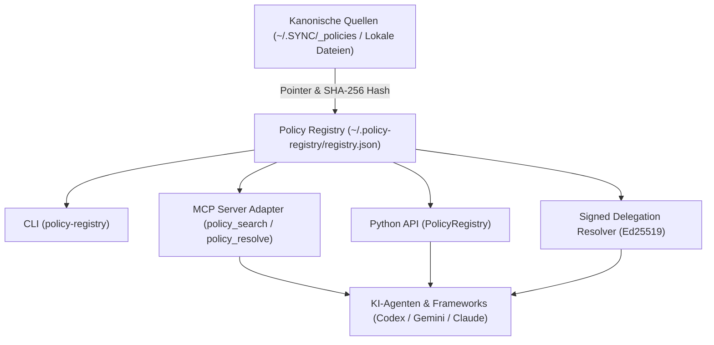
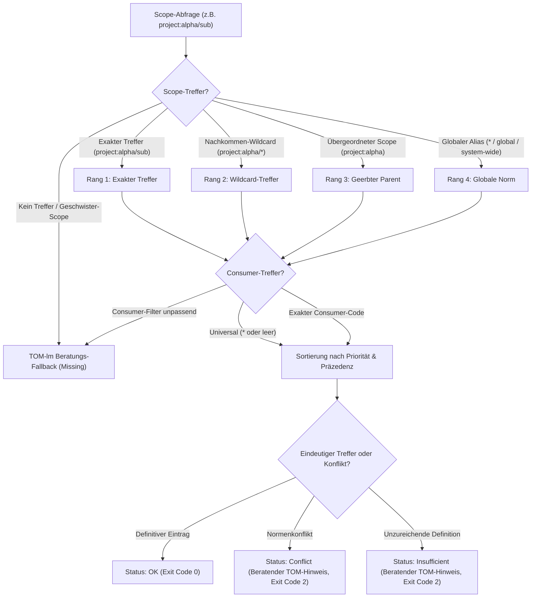
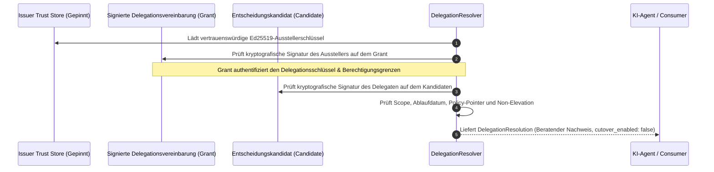

# policy-registry

[](https://www.python.org/downloads/)
[](LICENSE)
[](https://github.com/ellmos-ai/policy-registry)
[](ARCHITECTURE.md)
[](SECURITY.md)
[](SECURITY.md)
[](https://github.com/ellmos-ai)
[](https://github.com/open-bricks)
[](tests/)
[](llms.txt)

**🇩🇪 Deutsch** | [🇬🇧 English](README.md)

> [!NOTE]
> **KI- & LLM-Integrationshinweis**: Dieses Repository enthält eine [`llms.txt`](llms.txt)-Indexdatei für automatisierte Kontextaufnahme, System-Prompts für Agenten und maschinelles Codeverständnis.

`policy-registry` ist ein eigenständiges, wiederverwendbares **LOCAL-FIRST**-Register für Policies, Regeln und Entscheidungen. Es speichert Metadaten und Pointer auf kanonische Quellen, nicht deren Volltext. Dadurch bleiben lokale Quellen autoritativ und auffindbar, auch wenn OneDrive, `.SYNC` oder `system-gap-master` nicht verfügbar sind.

---

## Teststatus

Aktueller lokaler Nachweis vom 2026-08-21 (Python 3.12.10):

- `python -m pytest --collect-only` sammelt 75 Tests.
- `python -m pytest` besteht mit 75/75 Tests (100% grün).
- `ruff check .` besteht mit 0 Warnungen.

---

## Systemarchitektur



---

## Scope-Auflösung & Hierarchische Präzedenz

Das folgende Diagramm visualisiert, wie `PolicyRegistry` und der signierte Delegations-Resolver Geltungsbereiche, Präzedenzränge und beratende Rückmeldungen evaluieren:



---

## Lebenszyklus der kryptografischen Delegationsprüfung

`policy-registry` bietet eine kryptografische Verifikation für aussteller-delegierte Entscheidungskandidaten:



---

## Sicherheits- und Autoritätsvertrag

- Die lokale Registry unter `~/.policy-registry/registry.json` ist autoritativ für ihre Metadaten.
- Der kanonische Regeltext verbleibt an `source.uri`.
- `content`, `body`, `full_text` und `payload` werden als Registry-Felder abgewiesen.
- Gültige, explizit adoptierte `policy`, `rule` oder `decision` werden nach dem gemeinsamen hierarchischen Scope-Vertrag, danach nach Priorität und Präzedenz aufgelöst.
- Fehlt eine Norm, reicht sie nicht aus oder widersprechen sich gleichrangige Normen, meldet die Auflösung einen **beratenden TOM-lm-Fallback**. Sie ruft TOM-lm nicht automatisch auf und verleiht seinem Ergebnis keine Autorität.
- Ein TOM-Ergebnis darf als `evidence` oder `decision-candidate` registriert werden. Erst eine explizite Adoption macht daraus eine generalisierte Policy.

### Scope-Vertrag

`PolicyRegistry` und der signierte Delegation-Resolver teilen den Matcher aus [`src/policy_registry/scope.py`](src/policy_registry/scope.py):

1. Globale Aliaswerte `*`, `all`, `global` und `system-wide` gelten überall.
2. Ein normaler Scope gilt exakt und wird an Nachkommen vererbt (`project:alpha` gilt auch für `project:alpha/release`).
3. `project:alpha/*` gilt ausschließlich für Nachkommen, nicht für den Parent selbst.
4. Die Präzedenz lautet: `exact > /* > parent > global`. Bei gleicher Relation gewinnt der tiefere Pfad.
5. Geschwister matchen nicht.
6. Ein leerer Consumerfilter bedeutet „alle“, eine leere Consumerliste oder `*` ist universal; andernfalls ist der Consumer-Code exakt zu treffen.

---

## Metadatenmodell

Jeder Eintrag kennt mindestens:

| Feld | Bedeutung |
|---|---|
| `id`, `kind`, `title` | Stabile Identität und Typ |
| `scope`, `consumers` | Geltungsbereich und konsumierende Akteure |
| `owner`, `authority` | Eigentümer und Autoritätsart |
| `priority`, `precedence` | Auflösungsrang |
| `version`, `hash` | Version und optionaler SHA-256-Nachweis |
| `privacy` | `public`, `internal`, `private`, `restricted` |
| `source.uri` | Pointer auf die kanonische Quelle |
| `status`, `adoption` | Lebenszyklus und explizite Übernahme |

Das normative JSON-Schema liegt unter [`schemas/policy-entry.schema.json`](schemas/policy-entry.schema.json).

---

## CLI

```powershell
policy-registry init
policy-registry import-sync --root "$HOME\OneDrive\.SYNC\_policies" --slot workstation
policy-registry search "OneDrive" --consumer codex
policy-registry resolve --scope system-wide --query "OneDrive"
policy-registry verify
```

Ein alternativer lokaler Pfad kann mit `--registry` oder `POLICY_REGISTRY_PATH` gesetzt werden.

`resolve` liefert Exit `0` nur bei eindeutiger expliziter Auflösung. `missing`, `insufficient` und `conflict` liefern Exit `2` und einen strukturierten TOM-lm-Hinweis mit `automatic_authority: false`.

---

## Python-API

```python
from policy_registry import PolicyRegistry

registry = PolicyRegistry()
matches = registry.search("release", scope=".AI/.MODULES", consumer="codex")
decision = registry.resolve(scope="system-wide", query="OneDrive")
```

### Signierter Delegation-Resolver

`policy-registry` kann signierte Delegationsvereinbarungen (Issuer Grant) und delegierte Avatar-Entscheidungskandidaten gegen den lokalen Trust Store verifizieren:

```powershell
policy-registry resolve-delegation `
  --grant signed-grant.json `
  --candidate signed-candidate.json `
  --trust-store issuer-trust.json
```

Vertrag, Trust-Kette und Sicherheitsgrenzen: [`docs/SIGNED_DELEGATION_RESOLVER.md`](docs/SIGNED_DELEGATION_RESOLVER.md).

---

## Model Context Protocol (MCP)

Der optionale MCP-Adapter stellt `policy_search`, `policy_get` und `policy_resolve` für MCP-Clients bereit:

```powershell
pip install "policy-registry[mcp]"
python -m policy_registry.mcp_server
```

Das MCP-Extra bleibt bis zu einer ausdrücklich getesteten v2-Migration auf die gepflegte MCP-SDK-v1-Linie `>=1.28.1,<2` begrenzt.

---

## Ökosystem & Verwandte Werkzeuge

`policy-registry` ist integraler Bestandteil des `ellmos-ai`- und `open-bricks`-Ökosystems:

| Repository | Zweck | Ökosystem |
|---|---|---|
| [`ellmos-ai/memoryhooker`](https://github.com/ellmos-ai/memoryhooker) | Hook-basiertes Gedächtnis- und Kontextmanagementsystem für LLM-Agenten | `ellmos-ai` |
| [`ellmos-ai/ellmos-scheduler`](https://github.com/ellmos-ai/ellmos-scheduler) | Deterministischer Scheduler und Task-Runner für Agenten-Pipelines | `ellmos-ai` |
| [`ellmos-ai/ellmos-voice-io`](https://github.com/ellmos-ai/ellmos-voice-io) | Sprach-Ein-/Ausgabe-Adapter für multimodale Assistenten | `ellmos-ai` |
| [`ellmos-ai/lock-master`](https://github.com/ellmos-ai/lock-master) | Multi-Agent Locking- & Lease-Protokoll für koordinierte Workflows | `ellmos-ai` |
| [`ellmos-ai/ticket-master`](https://github.com/ellmos-ai/ticket-master) | Deterministisches Ticket-Management und Lebenszyklus-Koordination | `ellmos-ai` |
| [`ellmos-ai/clutch`](https://github.com/ellmos-ai/clutch) | Task-Ausführungs-Koordinator und Agenten-Laufzeitumgebung | `ellmos-ai` |
| [`ellmos-ai/ellmos-controlcenter-mcp`](https://github.com/ellmos-ai/ellmos-controlcenter-mcp) | Gateway und Orchestrator für lokale MCP-Werkzeugbündel | `ellmos-ai` |
| [`ellmos-ai/ellmos-filecommander-mcp`](https://github.com/ellmos-ai/ellmos-filecommander-mcp) | Local-First Desktop-Dateiverwaltungs-MCP-Server | `ellmos-ai` |
| [`ellmos-ai/ellmos-codecommander-mcp`](https://github.com/ellmos-ai/ellmos-codecommander-mcp) | AST-basierter Code-Analyse- & Transformations-MCP-Server | `ellmos-ai` |
| [`ellmos-ai/n8n-manager-mcp`](https://github.com/ellmos-ai/n8n-manager-mcp) | Local-First n8n Workflow-Management-MCP-Server | `ellmos-ai` |
| [`dev-bricks/automation-master`](https://github.com/dev-bricks/automation-master) | Local-First Event-Sourcing Ledger und Credit-Gate Automation Engine | `dev-bricks` |
| [`dev-bricks/DevCenter`](https://github.com/dev-bricks/DevCenter) | Entwickler-Arbeitsplatz und Automations-Cockpit | `dev-bricks` |
| [`dev-bricks/CodeBox`](https://github.com/dev-bricks/CodeBox) | Sichere Multi-Sprachen Code-Ausführungsumgebung | `dev-bricks` |
| [`dev-bricks/companion-for-agy`](https://github.com/dev-bricks/companion-for-agy) | PTY-Terminal-Companion und Session-Manager für Antigravity | `dev-bricks` |
| [`dev-bricks/safe-start-for-codex`](https://github.com/dev-bricks/safe-start-for-codex) | Workspace-Initialisierer und Preflight-Sicherheitsprüfer für Codex | `dev-bricks` |
| [`open-bricks/open-bricks`](https://github.com/open-bricks) | Dachorganisation für quelloffene Entwicklerwerkzeuge | `open-bricks` |

---

## Grenzen des MVP

- Keine automatische Volltextindexierung.
- Kein automatischer TOM-lm-Aufruf.
- Keine automatische Adoption.
- Kein gehosteter Cloud-Dienst (100% Local-First).
- Keine ungesicherten Fremdhost-Mutationen.

---

## Lizenz

MIT License — siehe [LICENSE](LICENSE).
